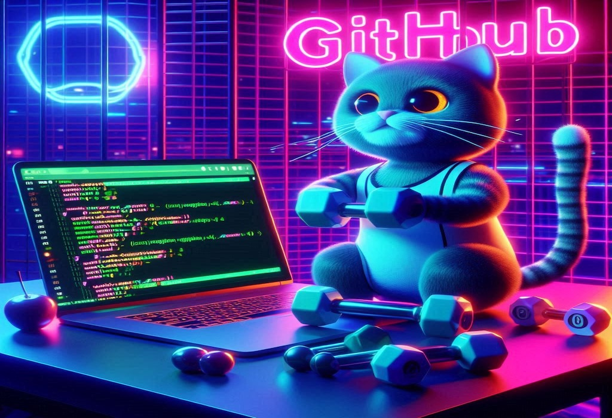

# Story about Thanos developing a fitness application now begins!

In a bustling tech hub, Thanos, a brilliant lead developer known for his unparalleled coding skills, was given an extraordinary challenge: Could he build OctoFit, an innovative fitness application designed to get the Avengers in top shape, in just 40 minutes as a web application proof of concept?
Thanos quickly gathered his team and sketched out a plan. OctoFit needed to handle the strength of Hulk, the agility of Black Widow, the speed of Quicksilver, and the precision of Hawkeye. With the clock ticking, the team divided tasks and worked at lightning speed.

In this workshop, you are going to assume to be the lead developer Thanos. You will be responsible for building the application with GitHub Copilot’s help. Good luck!

[Next: Prerequisites :soon:](../2_Prerequisites)
