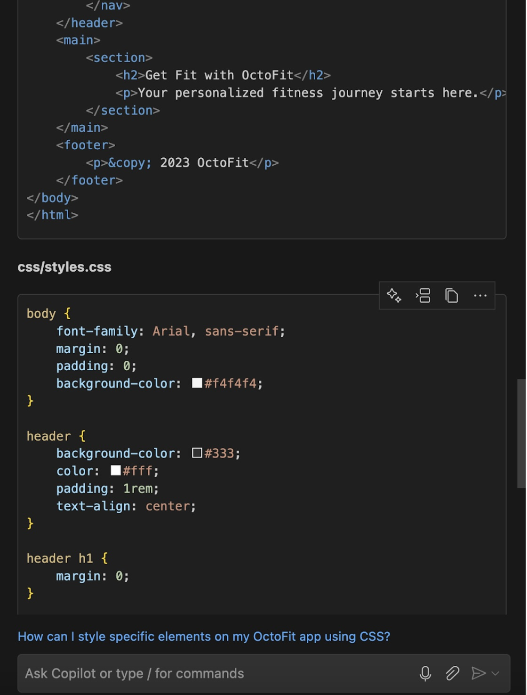

# Getting started - Front end setup with HTML and CSS

In this section, we will start by setting up the face of our OctoFit application by building the front end page. To do that, we will keep it as simple as possible for now. We need resources like HTML and CSS to start decorating first, and we will later modify the page to extend the functionalities.

## Goals/Outcome:
- Understand the basic strategies around designing the OctoFit app by asking GitHub Copilot Chat
- Start getting the feel for OctoFit app by generating HTML and CSS resources
- See a front-end page with a greeting message

Let’s start with the basic front end development with the help of GitHub Copilot. Although we can start using the built-in in-file Copilot suggestion, we will initiate this by using GitHub Copilot Chat.

After you open the GitHub Copilot Chat panel, please type the following prompt.

`I have this great idea called the OctoFit app. Can you show me the outline for how to get started? Please ignore technology stacks for now.`

The reason why I asked to ignore technology stack is because I want to keep it super simple. If we did not add that, what you will likely see is that some users will get code examples, while some others don’t, etc.

> TIP: One challenging thing about GitHub Copilot is that it is very generative. Thus, it is hard to make a consistent, repeatable tutorial unless you try to keep it simple and very progressive.
Once you get the result, try to read to see how you can approach creating our fitness application. Your result still might look different from mine, and that is perfectly okay!

Once you get the result, try to read to see how you can approach creating our fitness application. Your result still might look different from mine, and that is perfectly okay!

Now, let’s move onto the next prompt through GitHub Copilot Chat. This time, we want to generate some assets to create our web pages. HTML, which stands for Hyper Text Markup Language, is the language of the web, though it is not exactly a programming language, and CSS, which stands for Cascading Style Sheet, is the web language for the design. Thus, we will ask to generate these two. Let’s proceed with the following prompts. 

`Now, how can I add HTML and CSS on these?`

As you can see, this prompt will generate some examples of HTML and CSS lines that you can use. Again, your result might look different from mine, and that is perfectly okay!

How can we leverage these files? We can, of course, create new files and copy-and-paste those contents. But instead of doing that, GitHub Copilot Chat has built-in user interface buttons that can make those steps easier.

If you hover over the code, for example this HTML code block, you will see a popup menu shows up giving you different option like this.

We want to select the `Insert into New File` that will appear when you click `...` icon for more options.

That will create a new file tab with copied code block. Save the file with a name `index.html`.

You probably want to create a new directory or open a directory that is dedicated for this project. For me, I named it `OctoFit`.

Do the same for your CSS file. You can create a CSS file within the `css` folder like this.

