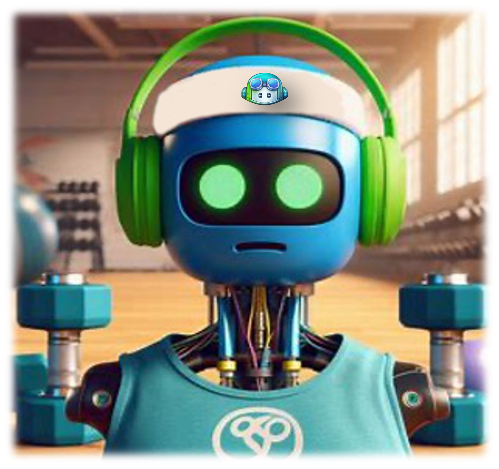

# Your journey to develop a fitness tracker with GitHub Copilot now begins!

Here's a reworked version of the workshop concept that's more suitable for a conference demo and attendee workshop:

## OctoFit Tracker: Building a Fitness App with GitHub Copilot

Welcome to the OctoFit Tracker workshop! In this hands-on session, you'll step into the shoes of a lead developer tasked with creating a cutting-edge fitness tracker in record time. We'll leverage the power of GitHub Copilot to rapidly develop a functional prototype of OctoFit Tracker, a social fitness app that encourages users to stay active and compete with their peers.

### Workshop Overview

In this workshop, you'll:

1. Set up a development environment using GitHub Codespaces
2. Use GitHub Copilot to accelerate development across multiple technologies
3. Build key components of the OctoFit Tracker app
4. Learn best practices for working with AI-assisted coding tools

### Application Features

OctoFit Tracker will include:

- User authentication and profiles
- Activity logging and tracking
- Team creation and management
- Competitive leaderboards
- Personalized workout suggestions

### Technology Stack

We'll be using a modern web application stack:

- **Frontend**: React.js
- **Backend**: Python with Django REST Framework
- **Database**: MongoDB
- **Development Environment**: GitHub Codespaces

### Workshop Structure

1. **Introduction and Setup of prerequisites**
   - Overview of OctoFit Tracker concept
   - Setting up GitHub Codespaces

2. **Rapid Prototyping with GitHub Copilot**
   - Creating project structure
   - Generating boilerplate code
   - Implementing basic models and views

3. **Building Core Features**
   - User authentication
   - Activity logging API
   - Team management
   - Leaderboard functionality

4. **Frontend Development**
   - Setting up React components
   - Implementing responsive UI
   - Connecting to backend APIs

5. **Advanced Features and Optimization**
   - Adding personalized workout suggestions
   - Implementing caching with Redis
   - Optimizing database queries

6. **Wrap-up and Q&A**
   - Reviewing what we've built
   - Discussing best practices and lessons learned
   - Q&A session

### Key Takeaways

By the end of this workshop, attendees will:

- Gain hands-on experience with GitHub Copilot in a real-world scenario
- Learn strategies for effective AI-assisted development
- Understand how to leverage Copilot across different languages and frameworks
- Develop a functional prototype of a modern web application

Join us for this exciting journey into the future of software development, where we'll harness the power of generative AI with GitHub Copilot to build OctoFit Tracker in record time!

In this workshop, you are going to assume to be the lead developer. You will be responsible for building the application with GitHub Copilot’s help. Good luck!

[Next: Prerequisites, assumptions, and development environment setup](../2_Prerequisites)
