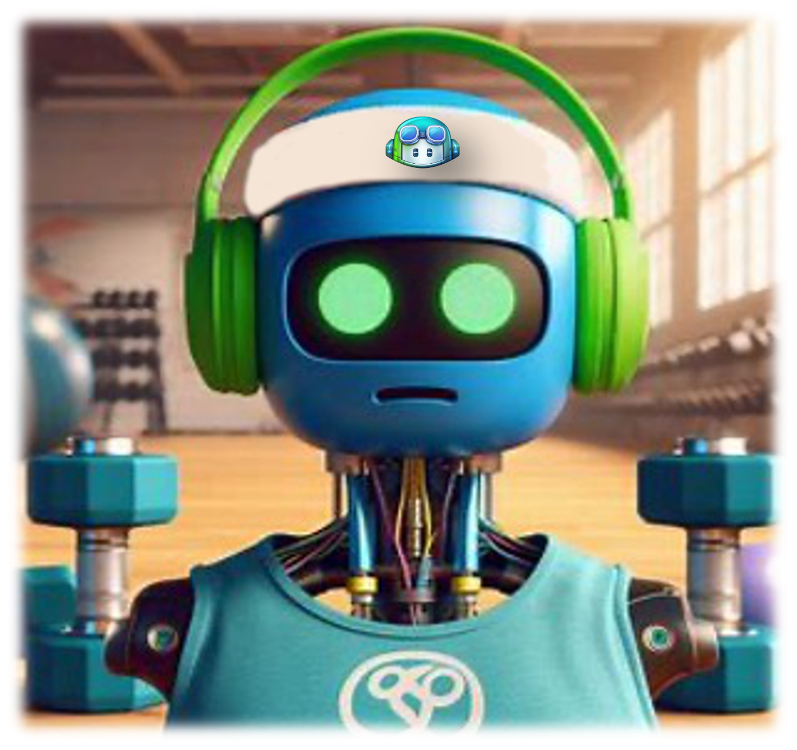

# Story to develop a fitness application with GitHub Copilot now begins!

Fitness app “OctoFit Tracker” tracks the exercise on a personal level, competes with others (rank scoring), and suggests some fitness activities. This app has a beautiful interface that tracks the user’s fitness activities, login interface, and provides personalization options. It has a way to save that data in the backend, which can compete with other fitness buddies. The purpose of this app is to keep everyone motivated to login their activities within their own teams – there are several different teams within the app.

As the chief programmer, you are assigned to design this application in less than a week and show a POC to the CEO of the OctoFit Corporation. You were not sure what to do, but you heard about the great results of launching the applications ASAP through this thing called GitHub Copilot. You start building the application with technology stacks that you are familiar with. You decided to make it as a web application, though extensible later to mobile app, so you will use ReactJS for the front end, Python Django so we can leverage REST API as the backend, and MongoDB as the main database with possible in-memory data storage like Redis or Kafka. You also want to start testing out in a local environment, so Docker container will be good, but it will be later deployed to Microsoft Azure as the container app, and you want to automate the deployment through GitHub Actions in addition to leveraging something like Terraform.

In this workshop, you are going to assume to be the lead developer. You will be responsible for building the application with GitHub Copilot’s help. Good luck!

[Next: Prerequisites :soon:](../2_Prerequisites)
