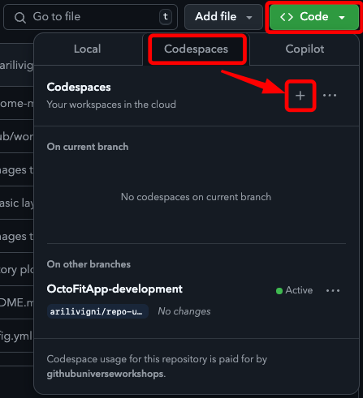

# Prerequisites, assumptions, and development environment setup

## Prerequisites

- GitHub account
- GitHub Copilot license

## OctoFit Tracker technology stack

- NodeJS: Version xxx
- ReactJS: Version xxx
- Python Django: Version xxx

## Developer environment setup

### Go to the code tab

### Create a GitHub codespace

## Assumptions

Two approaches:
Ask Copilot to generate a lot of boiler plate codes first time:
PROS: Create a lot of structures that we probably need later
CONS: Probably need to make a bunch of changes to make it work. Hard to make it into a tutorial.
Good for: When you actually work for the real project
Bad for: Make it a tutorial like format
Ask Copilot to make incremental, graduate changes
PROS: More predictable and easy to make it procedural steps
CONS: Can take more time and strategy later
Good for: Tutorial
Bad for: Real project

We will choose the second approach because we want to make it a more procedural step-by-step approach.

[:back: Previous: Story](../1_Story) | [Next: Getting started - Front end setup with HTML and CSS :soon:](../3_GettingStarted)
