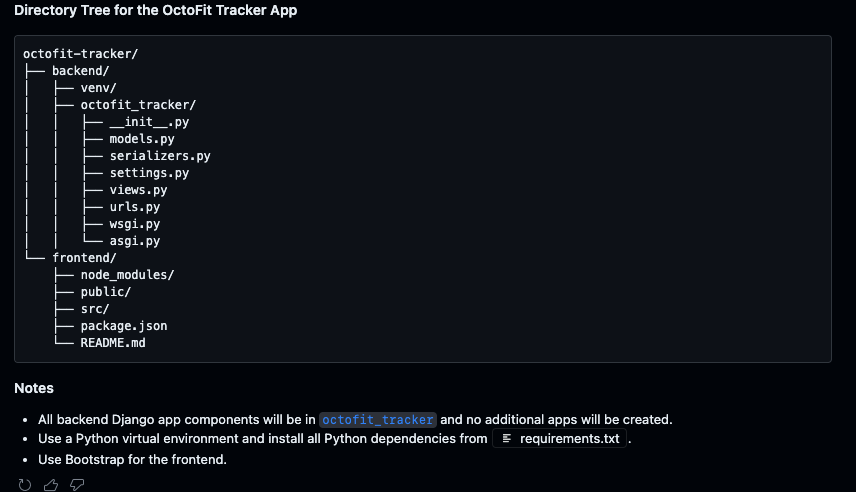

# Getting started

In this section, we will start by setting up the face of our OctoFit application by building the front end page. To do that, we will keep it as simple as possible for now. We need resources like HTML and CSS to start decorating first, and we will later modify the page to extend the functionalities.

> TIP: One challenging thing about GitHub Copilot is that it is very generative. Thus, it is hard to make a consistent, repeatable tutorial unless you try to keep it simple and very progressive.

## Explain to GitHub Copilot the goals and steps

It is important to lay out a plan and provide details. Type the following prompt:

```text
I want to build an OctoFit Tracker app that will include the following:

* User authentication and profiles
* Activity logging and tracking
* Team creation and management
* Competitive leader boards
* Personalized workout suggestions

It should be in one app

generate instructions in this order

1. Create the frontend and backend in the octofit-tracker directory of this repository in one command
2. the octofit-tracker/backend directory will store the django app with no subdirectories
3. setup backend python venv and install octofit-tracker/requirements.txt first
4. Create the django app directly in the directory octofit_tracker/backend
5. setup the octofit-tracker/frontend directory will store the react app with no subdirectories
6. instlal bootstrap
7. Install and setup mongodb with the 'sudo service mongodb start' and 'sudo service mongodb status'
 

Use a Python virtual environment and install all python dependencies from file octofit-tracker/requirements.txt in this workspace

The octofit-tracker/requirements.txt already contains all Django requirements. Django, djongo, sqlparse

Layout the directory structure with no redundant backend and frontend subdirectories

Use bootstrap for the frontend

Let's think about this step by step

Important to avoid using public code and we do NOT need to initialize the git repository
```




[Back :: Previous: Prerequisites and development environment setup](../2_Prerequisites) | [Next :: MongoDB install and setup](../4_BackendSettings)
