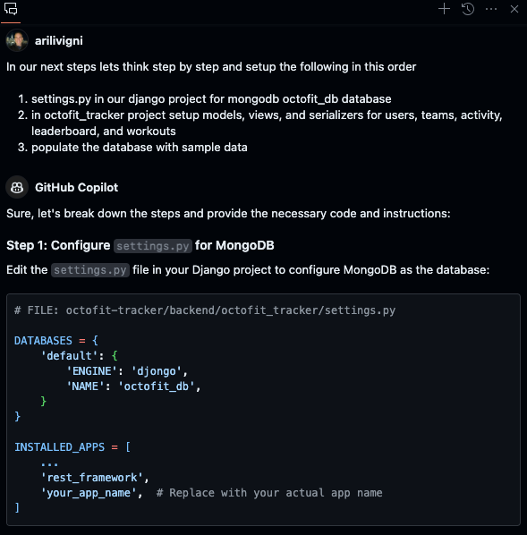
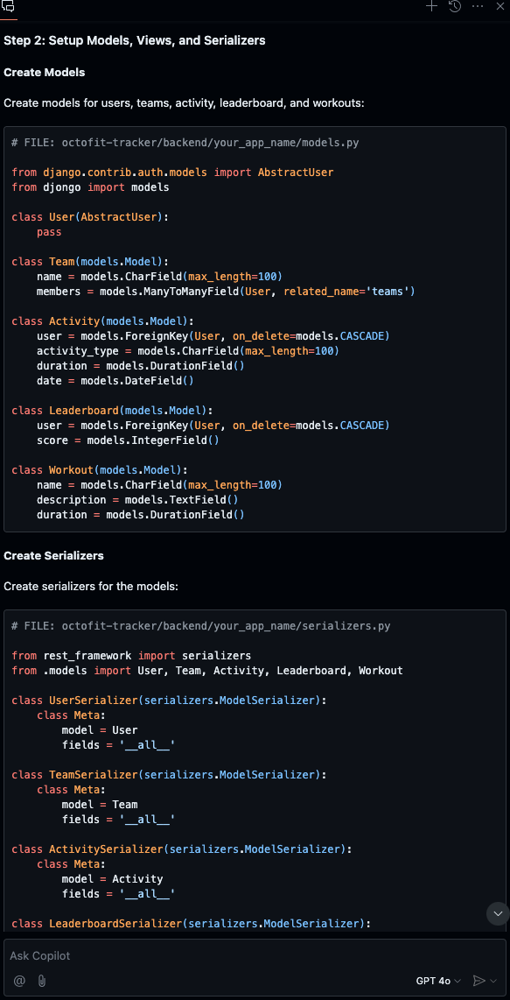
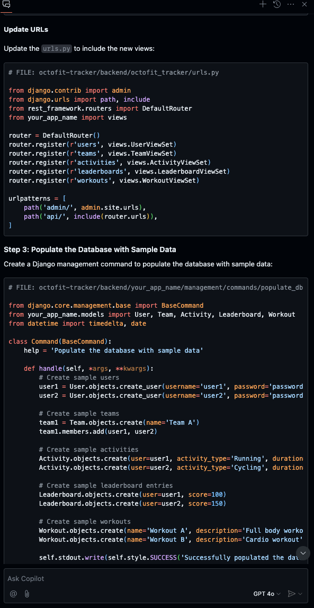

# Setup database in settings.py, models, views, serializers, and populate data

## Use Copilot Chat and paste the following

```text
In our next steps lets think step by step and setup the following in this order

1. settings.py in our django project for mongodb octofit_db database
2. In octofit_tracker project setup models, views, and serializers for users, teams, activity, leaderboard, and workouts
3. populate the database with sample data
```





[Back :: Previous: Getting started](../3_GettingStarted) | [Next :: Populate database with data via manage.py](../5_PopulateDBwData)
