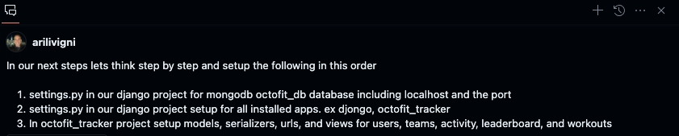
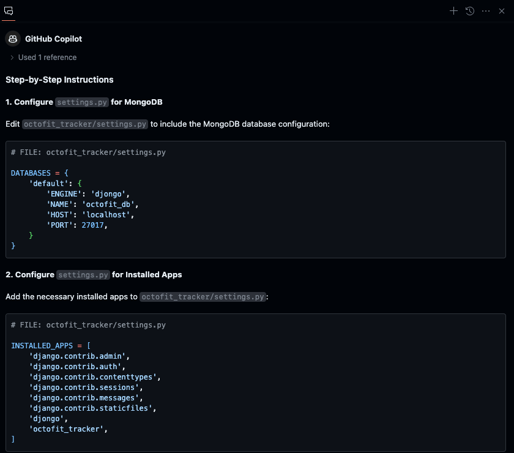
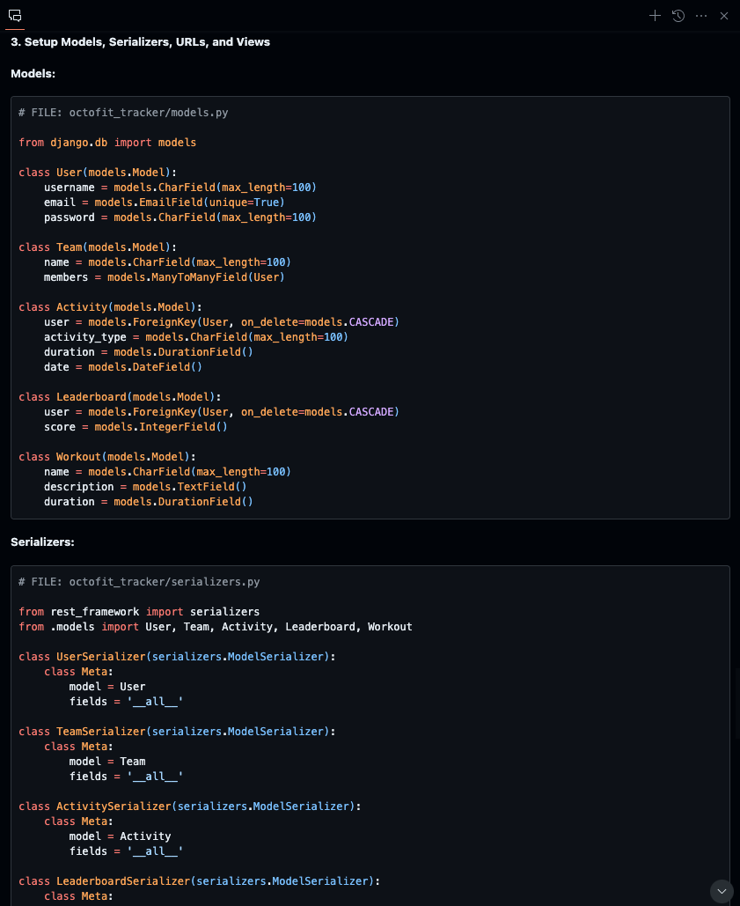
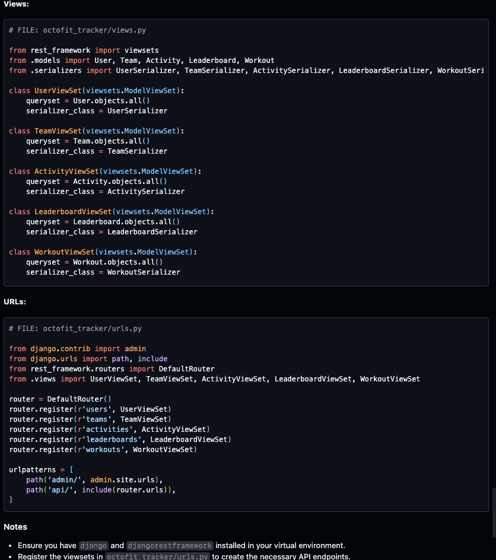

# Setup database in settings.py, models, views, serializers, and populate data

## Use Copilot Chat

Type the following prompt in GitHub Copilot Chat:

```text
In our next steps lets think step by step and setup the following in this order

1. settings.py in our django project for mongodb octofit_db database including localhost and the port
2. settings.py in our django project setup for all installed apps. ex djongo, octofit_tracker
3. In octofit_tracker project setup models, serializers, urls, and views for users, teams, activity, leaderboard, and workouts
```

</br>
</br>
</br>
</br>

### Sample settings.py

```json
# FILE: octofit_tracker/settings.py

DATABASES = {
    'default': {
        'ENGINE': 'djongo',
        'NAME': 'octofit_db',
        'HOST': 'localhost',
        'PORT': 27017,
    }
}
```

```json
# FILE: octofit_tracker/settings.py

INSTALLED_APPS = [
    'django.contrib.admin',
    'django.contrib.auth',
    'django.contrib.contenttypes',
    'django.contrib.sessions',
    'django.contrib.messages',
    'django.contrib.staticfiles',
    'rest_framework',
    'djongo',
    'octofit_tracker',
]
```

### Sample code for models.py, serializers.py, views.py, and urls.py

#### models.py

```python
# FILE: octofit_tracker/models.py

from django.db import models

class User(models.Model):
    username = models.CharField(max_length=100)
    email = models.EmailField(unique=True)
    password = models.CharField(max_length=100)

class Team(models.Model):
    name = models.CharField(max_length=100)
    members = models.ManyToManyField(User)

class Activity(models.Model):
    user = models.ForeignKey(User, on_delete=models.CASCADE)
    activity_type = models.CharField(max_length=100)
    duration = models.DurationField()
    date = models.DateField()

class Leaderboard(models.Model):
    user = models.ForeignKey(User, on_delete=models.CASCADE)
    score = models.IntegerField()

class Workout(models.Model):
    name = models.CharField(max_length=100)
    description = models.TextField()
    duration = models.DurationField()
```

#### serializers.py

```python
# FILE: octofit_tracker/serializers.py

from rest_framework import serializers
from .models import User, Team, Activity, Leaderboard, Workout

class UserSerializer(serializers.ModelSerializer):
    class Meta:
        model = User
        fields = '__all__'

class TeamSerializer(serializers.ModelSerializer):
    class Meta:
        model = Team
        fields = '__all__'

class ActivitySerializer(serializers.ModelSerializer):
    class Meta:
        model = Activity
        fields = '__all__'

class LeaderboardSerializer(serializers.ModelSerializer):
    class Meta:
        model = Leaderboard
        fields = '__all__'

class WorkoutSerializer(serializers.ModelSerializer):
    class Meta:
        model = Workout
        fields = '__all__'
```

#### views.py

```python
# FILE: octofit_tracker/views.py

from rest_framework import viewsets
from .models import User, Team, Activity, Leaderboard, Workout
from .serializers import UserSerializer, TeamSerializer, ActivitySerializer, LeaderboardSerializer, WorkoutSerializer

class UserViewSet(viewsets.ModelViewSet):
    queryset = User.objects.all()
    serializer_class = UserSerializer

class TeamViewSet(viewsets.ModelViewSet):
    queryset = Team.objects.all()
    serializer_class = TeamSerializer

class ActivityViewSet(viewsets.ModelViewSet):
    queryset = Activity.objects.all()
    serializer_class = ActivitySerializer

class LeaderboardViewSet(viewsets.ModelViewSet):
    queryset = Leaderboard.objects.all()
    serializer_class = LeaderboardSerializer

class WorkoutViewSet(viewsets.ModelViewSet):
    queryset = Workout.objects.all()
    serializer_class = WorkoutSerializer
```

#### urls.py

```python
# FILE: octofit_tracker/urls.py

from django.contrib import admin
from django.urls import path, include
from rest_framework.routers import DefaultRouter
from .views import UserViewSet, TeamViewSet, ActivityViewSet, LeaderboardViewSet, WorkoutViewSet

router = DefaultRouter()
router.register(r'users', UserViewSet)
router.register(r'teams', TeamViewSet)
router.register(r'activities', ActivityViewSet)
router.register(r'leaderboards', LeaderboardViewSet)
router.register(r'workouts', WorkoutViewSet)

urlpatterns = [
    path('admin/', admin.site.urls),
    path('api/', include(router.urls)),
]
```

[Back :: Previous: Getting started](../3_GettingStarted) | [Next :: Populate database with data via manage.py](../5_PopulateDBwData)
