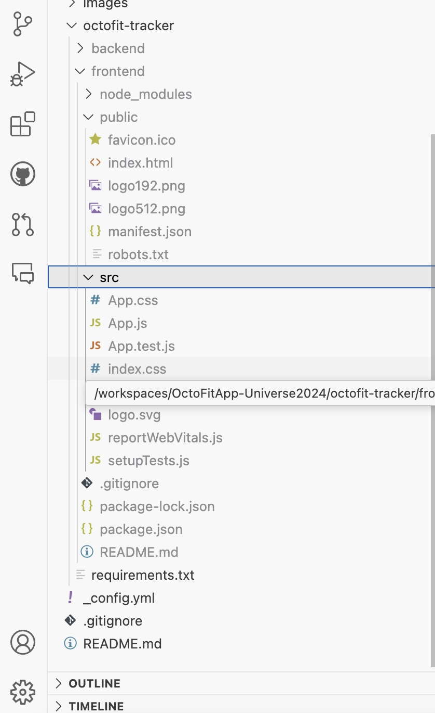
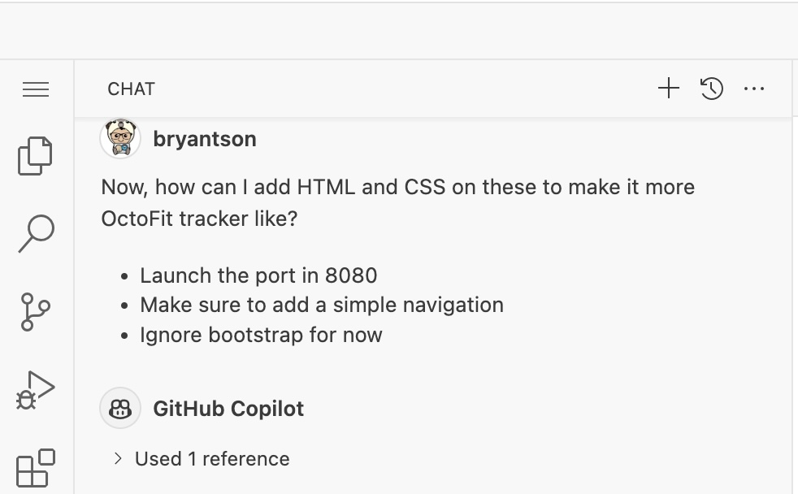
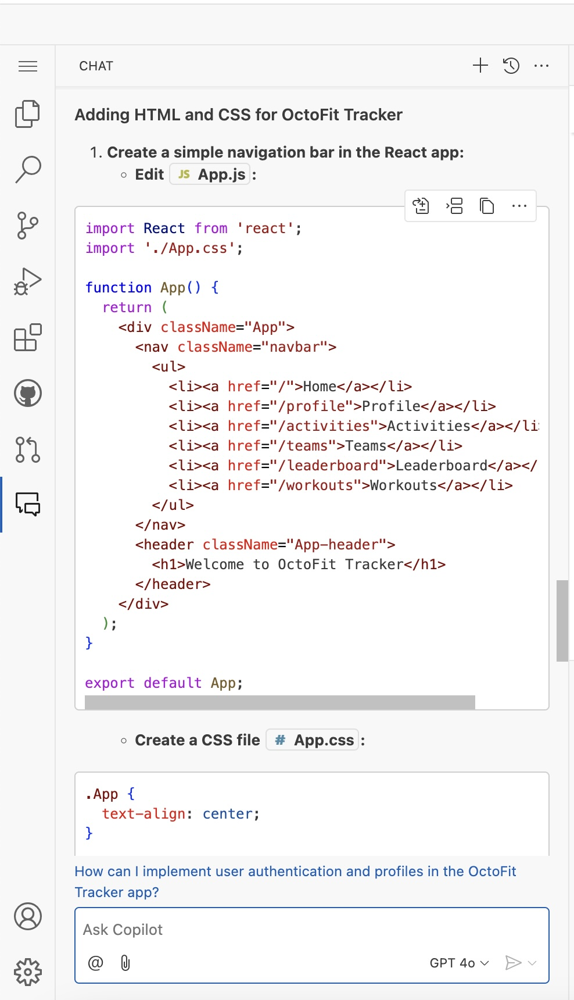
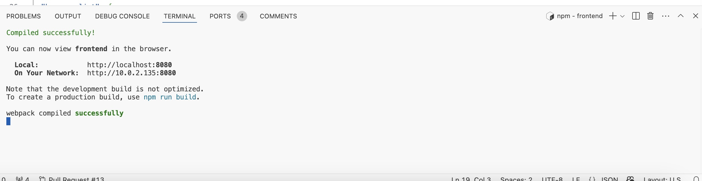
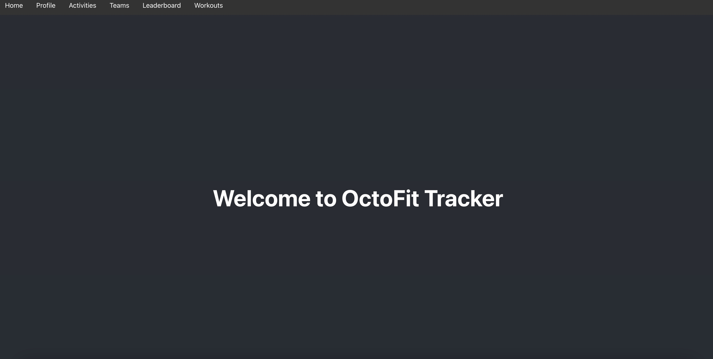

# Let's build some beautiful front end

In this section, we will start by setting up the face of our OctoFit application by building the front end page. To do that, we will keep it as simple as possible for now. We need resources like **HTML** and **CSS** to start decorating first, and we will later modify the page to extend the functionalities.

## Goals/Outcome

- Understand the basic strategies around designing the **OctoFit Tracker** app by asking **GitHub Copilot** Chat
- Start getting the feel for OctoFit app by generating HTML and CSS resources
- See a front-end page with a greeting message

Let's take a look at what we have so far by expanding the `octofit-tracker/frontend`. It will look something like this:



Let's expand `public` section because that is where we will find our static files.

Type the following prompt in GitHub Copilot Chat:

> TIP: we are going to use gpt-4o as our OpenAI GPT model for this GitHub Universe Workshop

```text
Now, how can I add HTML and CSS on these to make it more OctoFit tracker like?

Launch the port in 8080
Make sure to add a simple navigation
Ignore bootstrap for now
```

If I type that command in the GitHub **Copilot Chat**, it may look like this:



And the generated response might look like this:



> :warning: **TIP:** What if you don't get the same response? That's okay! The beauty of GitHub Copilot is that it is generative, and it will give you a different response each time. The key is to be persistent and keep asking the same question in different ways until you get a response that you are happy with. :smile:

And if you type the following command in the GitHub **Copilot Chat**, it will create a new port in `8080`.



And the final result should look like this:



That is it! Please refer to the **Solution** below or the [troubleshoot guide](../9_Troubleshooting/README.md) if you encounter any issues.

## Solution

This shows one possible solution where you need to make a change:

### Modify the following files:

`src/App.js`

```javascript
import React from 'react';
import './App.css';

function App() {
  return (
    <div className="App">
      <nav className="navbar">
        <ul>
          <li><a href="/">Home</a></li>
          <li><a href="/profile">Profile</a></li>
          <li><a href="/activity">Activity</a></li>
          <li><a href="/teams">Teams</a></li>
          <li><a href="/leaderboard">Leaderboard</a></li>
          <li><a href="/workouts">Workouts</a></li>
        </ul>
      </nav>
      <header className="App-header">
        <h1>Welcome to OctoFit Tracker</h1>
      </header>
    </div>
  );
}

export default App;
```

Create or modify `src/App.css`

```css
.App {
  text-align: center;
}

.navbar {
  background-color: #333;
  overflow: hidden;
}

.navbar ul {
  list-style-type: none;
  margin: 0;
  padding: 0;
}

.navbar li {
  float: left;
}

.navbar li a {
  display: block;
  color: white;
  text-align: center;
  padding: 14px 16px;
  text-decoration: none;
}

.navbar li a:hover {
  background-color: #111;
}

.App-header {
  background-color: #282c34;
  min-height: 100vh;
  display: flex;
  flex-direction: column;
  align-items: center;
  justify-content: center;
  font-size: calc(10px + 2vmin);
  color: white;
}
```


`package.json`
Update the following section:

```json
  "scripts": {
    "start": "PORT=8080 react-scripts start",
    "build": "react-scripts build",
    "test": "react-scripts test",
    "eject": "react-scripts eject"
  },
```

### Run the following commands:

```bash
cd octofit-tracker/frontend
```

Then, followed by...

```bash
npm start
```

Check the browser at the port `8080` to see the changes.

[Previous: Getting started - app frontend and backend creation](../3_GettingStarted/README.md) | [Next: The OctoFit Tracker database and app backend creation](../5_BackendSettings/README.md)