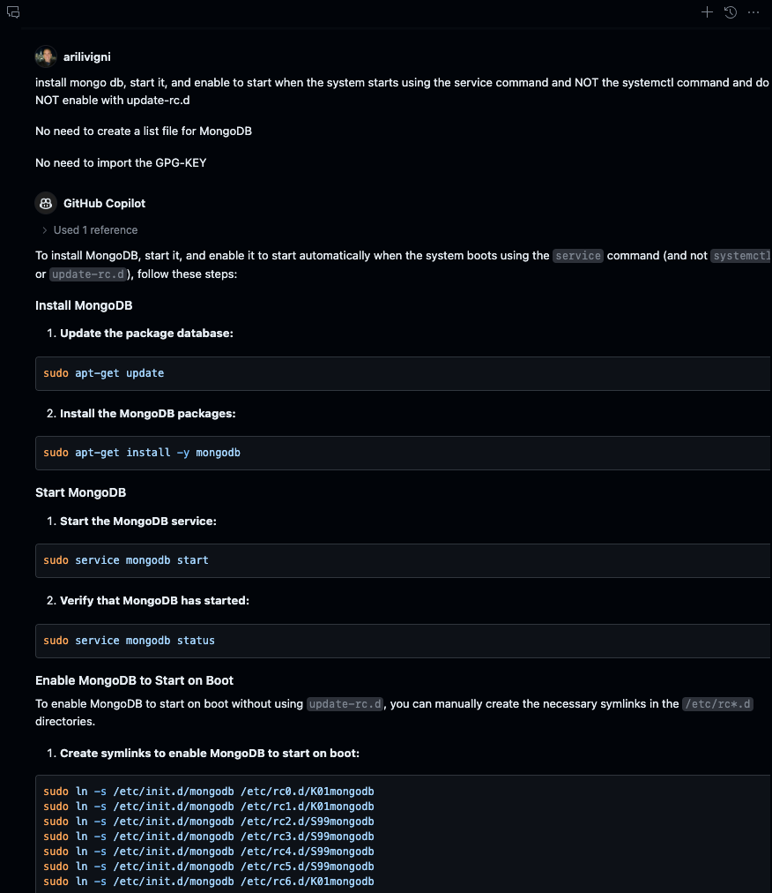

# MongoDB install and setup

## Use Copilot Chat and paste the following

```text
Provide steps to install mongodb, start it, and enable it at startup using sudo service commands and init.d

example:
sudo ln -s /etc/init.d/mongodb /etc/rc0.d/K01mongodb

No need to create a list file for MongoDB

No need to import the GPG-KEY
```



[Back :: Previous: Getting started](../3_GettingStarted) | [Next :: TBD](../5_PythonVenv)
