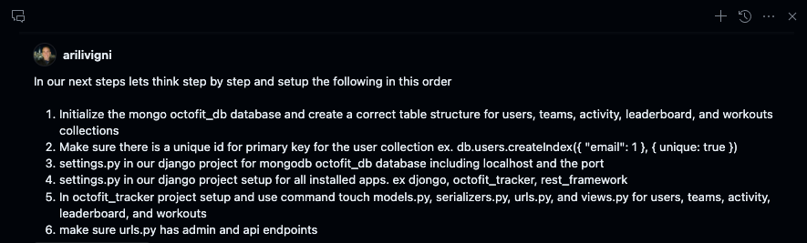
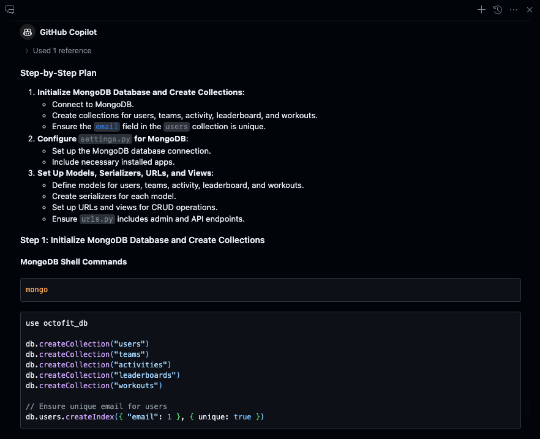
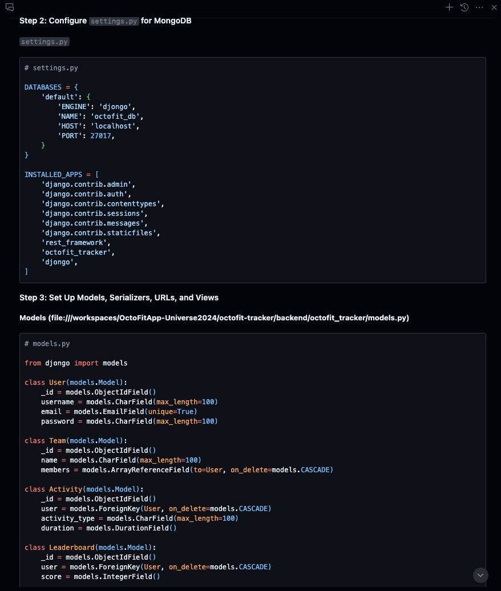
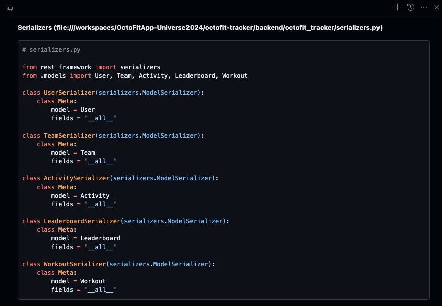
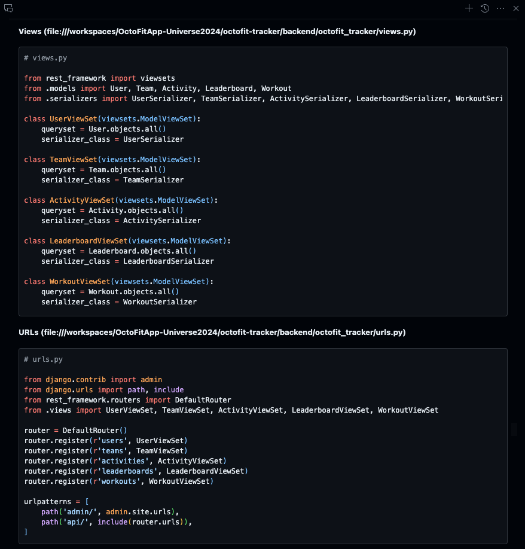

# The OctoFit Tracker database and app backend creation

## Initialize the database, setup database and install apps in settings.py, models, serializers, urls, and views

Type the following prompt in GitHub Copilot Chat:

```text
In our next steps lets think step by step and setup the following in this order

1. Initialize the mongo octofit_db database and create a correct table structure for users, teams, activity, leaderboard, and workouts collections
2. Make sure there is a unique id for primary key for the user collection 
   ex. db.users.createIndex({ "email": 1 }, { unique: true })
3. settings.py in our django project for mongodb octofit_db database including localhost and the port
4. settings.py in our django project setup for all installed apps. ex djongo, octofit_tracker, rest_framework
5. In octofit_tracker project setup and use command touch models.py, serializers.py, urls.py, and views.py for users, teams, activity, leaderboard, and workouts
6. Generate code for models.py, serializers.py, and views.py and
7. make sure urls.py has a root, admin, and api endpoints
```

</br>
</br>
</br>
</br>
</br>

### MongoDB commands to setup `octofit_db`

mongo
use octofit_db
db.createCollection("users")
db.createCollection("teams")
db.createCollection("activity")
db.createCollection("leaderboard")
db.createCollection("workouts")
db.users.createIndex({ "email": 1 }, { unique: true })
db.teams.createIndex({ "name": 1 }, { unique: true })
db.activity.createIndex({ "user": 1, "activity_type": 1 }, { unique: true })
db.leaderboard.createIndex({ "user": 1 }, { unique: true })
db.workouts.createIndex({ "user": 1 }, { unique: true })
exit

### Sample settings.py

```json
# FILE: octofit_tracker/settings.py

DATABASES = {
    'default': {
        'ENGINE': 'djongo',
        'NAME': 'octofit_db',
        'HOST': 'localhost',
        'PORT': 27017,
    }
}
```

```json
# FILE: octofit_tracker/settings.py

INSTALLED_APPS = [
    'django.contrib.admin',
    'django.contrib.auth',
    'django.contrib.contenttypes',
    'django.contrib.sessions',
    'django.contrib.messages',
    'django.contrib.staticfiles',
    'rest_framework',
    'djongo',
    'octofit_tracker',
]
```

### Sample code for models.py, serializers.py, views.py, and urls.py

#### models.py

```python
# FILE: octofit-tracker/backend/octofit_tracker/models.py

from djongo import models
from django.core.exceptions import ValidationError

class User(models.Model):
    email = models.EmailField(unique=True)
    username = models.CharField(max_length=100)
    password = models.CharField(max_length=100)

class Team(models.Model):
    name = models.CharField(max_length=100)
    members = models.ArrayReferenceField(
        to=User,
        on_delete=models.CASCADE
    )

class Activity(models.Model):
    user = models.ForeignKey(User, on_delete=models.CASCADE)
    activity_type = models.CharField(max_length=100)
    duration = models.IntegerField()

class Leaderboard(models.Model):
    user = models.ForeignKey(User, on_delete=models.CASCADE)
    score = models.IntegerField()

class Workout(models.Model):
    user = models.ForeignKey(User, on_delete=models.CASCADE)
    workout_plan = models.TextField()
```

#### serializers.py

```python
# FILE: octofit-tracker/backend/octofit_tracker/serializers.py

from rest_framework import serializers
from .models import User, Team, Activity, Leaderboard, Workout

class UserSerializer(serializers.ModelSerializer):
    class Meta:
        model = User
        fields = '__all__'

class TeamSerializer(serializers.ModelSerializer):
    class Meta:
        model = Team
        fields = '__all__'

class ActivitySerializer(serializers.ModelSerializer):
    class Meta:
        model = Activity
        fields = '__all__'

class LeaderboardSerializer(serializers.ModelSerializer):
    class Meta:
        model = Leaderboard
        fields = '__all__'

class WorkoutSerializer(serializers.ModelSerializer):
    class Meta:
        model = Workout
        fields = '__all__'
```

#### views.py

```python
# FILE: octofit_tracker/views.py

from .serializers import UserSerializer, TeamSerializer, ActivitySerializer, LeaderboardSerializer, WorkoutSerializer
from rest_framework.response import Response
from rest_framework.decorators import api_view

class UserViewSet(viewsets.ModelViewSet):
    queryset = User.objects.all()
    serializer_class = UserSerializer

class TeamViewSet(viewsets.ModelViewSet):
    queryset = Team.objects.all()
    serializer_class = TeamSerializer

class ActivityViewSet(viewsets.ModelViewSet):
    queryset = Activity.objects.all()
    serializer_class = ActivitySerializer

class LeaderboardViewSet(viewsets.ModelViewSet):
    queryset = Leaderboard.objects.all()
    serializer_class = LeaderboardSerializer

class WorkoutViewSet(viewsets.ModelViewSet):
    queryset = Workout.objects.all()
    serializer_class = WorkoutSerializer

@api_view(['GET'])
def api_root(request, format=None):
    base_url = 'http://upgraded-space-happiness-959pr7vpgw3p7vv-8000.app.github.dev/'
    return Response({
        'users': base_url + 'api/users/?format=api',
        'teams': base_url + 'api/teams/?format=api',
        'activity': base_url + 'api/activity/?format=api',
        'leaderboard': base_url + 'api/leaderboard/?format=api',
        'workouts': base_url + 'api/workouts/?format=api'
    })
```

#### urls.py

```python
# FILE: octofit_tracker/urls.py

from django.contrib import admin
from django.urls import path, include
from rest_framework.routers import DefaultRouter
from .views import UserViewSet, TeamViewSet, ActivityViewSet, LeaderboardViewSet, WorkoutViewSet, api_root

router = DefaultRouter()
router.register(r'users', UserViewSet)
router.register(r'teams', TeamViewSet)
router.register(r'activity', ActivityViewSet)
router.register(r'leaderboard', LeaderboardViewSet)
router.register(r'workouts', WorkoutViewSet)

urlpatterns = [
    path('', api_root, name='api-root'),  # Root endpoint
    path('admin/', admin.site.urls),  # Admin endpoint
    path('api/', include(router.urls)),  # API endpoint
]
```

[:arrow_backward: Previous: Let's work on front end](../4_FrontEndWork/README.md) | [Next: Populate the database with sample data :arrow_forward:](../6_PopulateDBwData/README.md)
