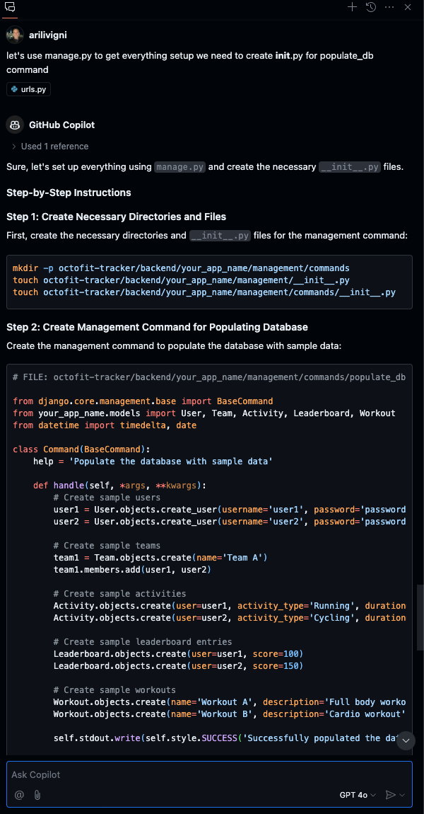
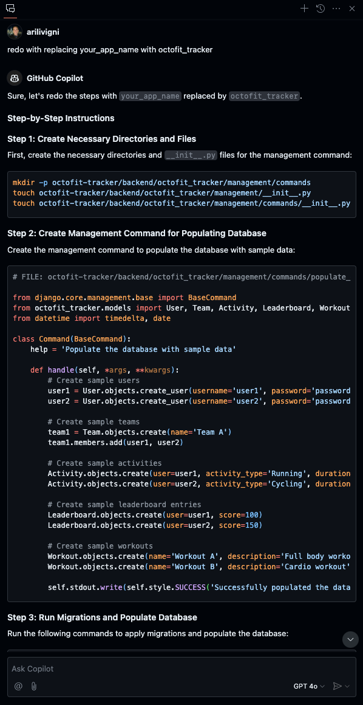
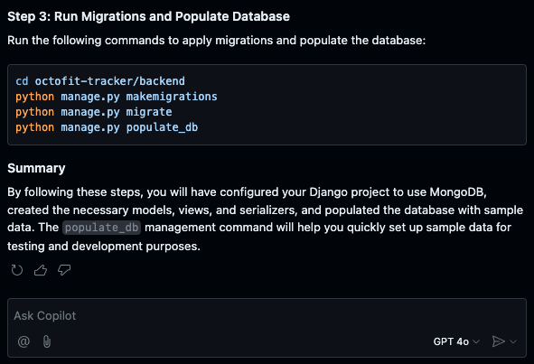

# Populate database with data via manage.py

## Example of not being specific

Type the following prompt:

```text
Let's use manage.py to get everything setup we need to create init.py for populate_db command include steps to migrate as well
```

### Example of not being specfic in prompting Copilot Chat



## Example of being more specific in our prompt

### Let's be more specific and ask Copilot to update the output with the octofit_tracker app name

```text
Let's use manage.py to get everything setup we need to create init.py for populate_db command include steps to migrate as well in the octofit_tracker project
```




