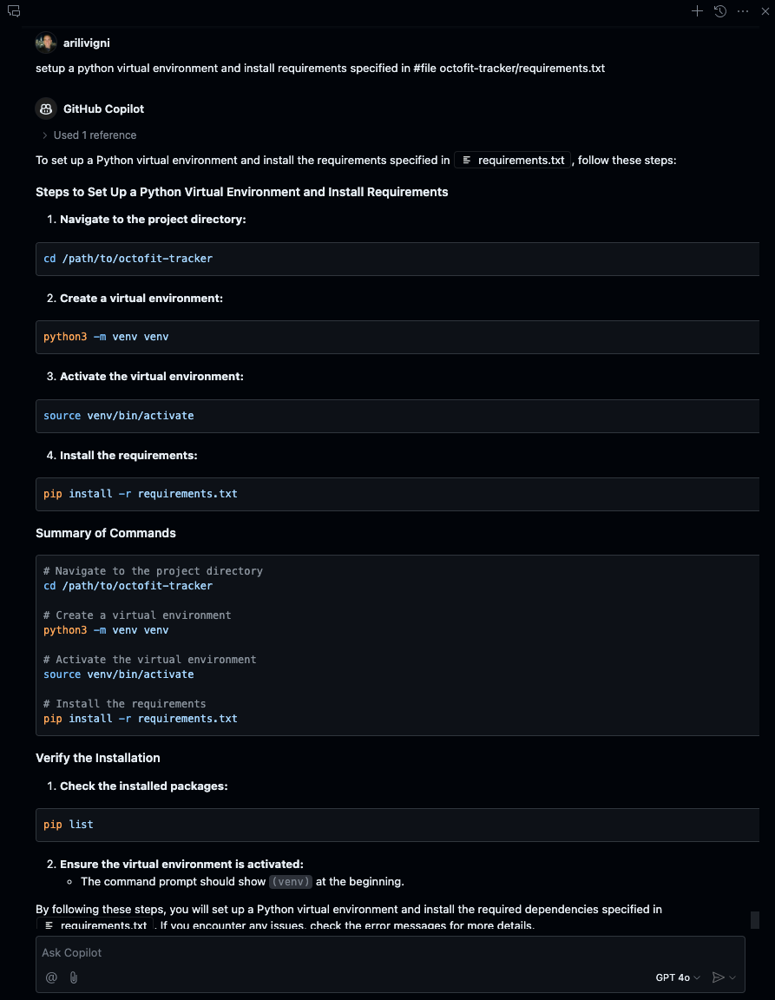

# Python virtual environment and dependencies

## Use Copilot Chat and paste the following

```text
setup a python virtual environment and install requirements specified in #file octofit-tracker/requirements.txt
```



[Back :: MongoDB install and setup](../4_MongoDBInstallSetup) | [Next :: Getting started](../4_MongoDBInstallSetup)