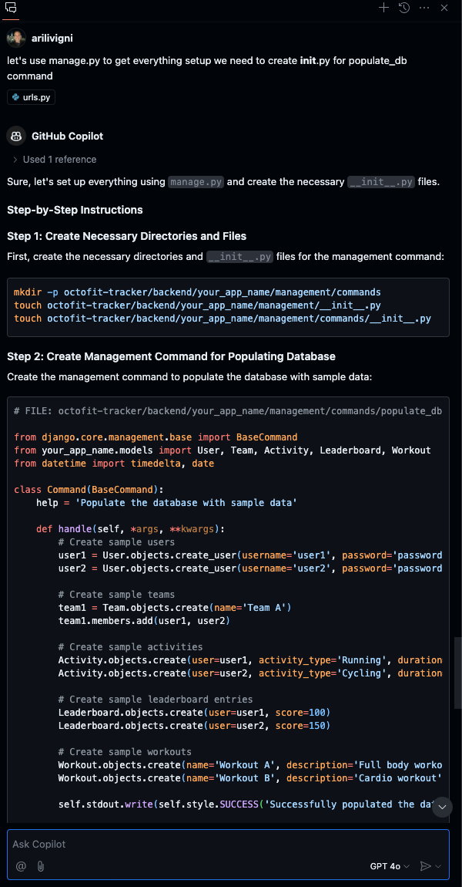
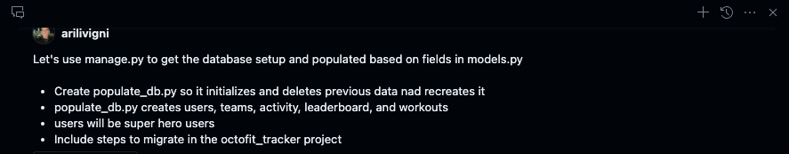
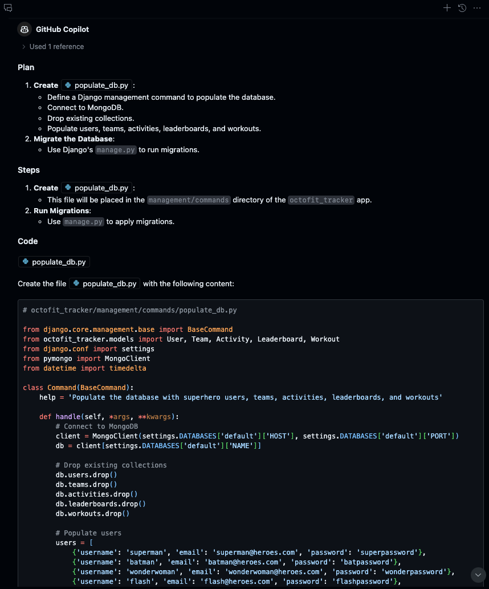
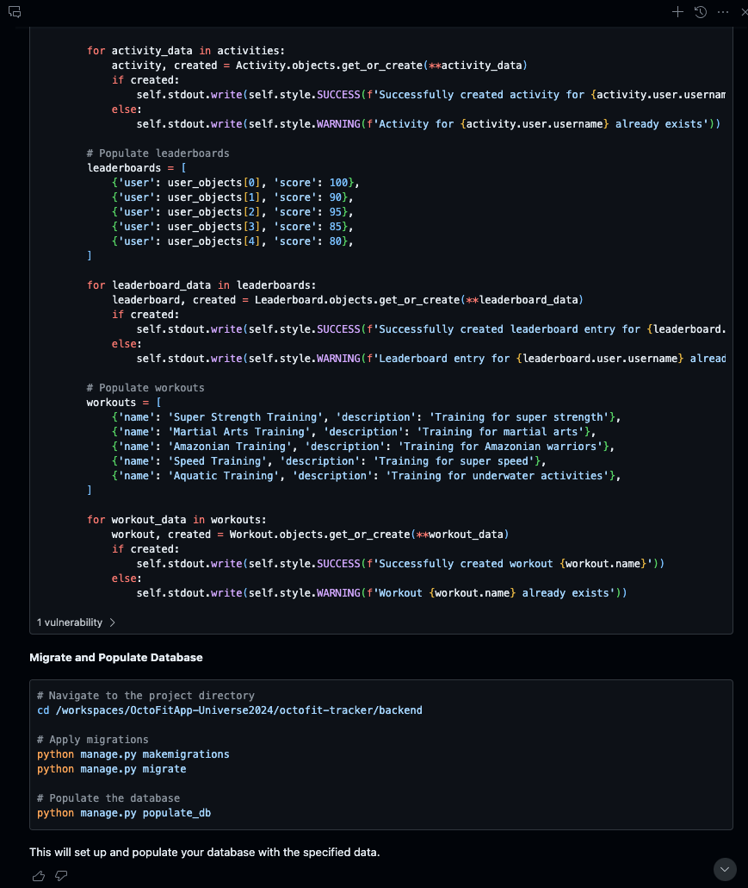

# Populate the database with sample data

## Example of not being specific

> NOTE: This is an example of not being specific skip this prompt and go to the next one

```text
Let's use manage.py to get everything setup we need to populate_db command include steps to migrate as well
```

### Example of not being specfic in prompting Copilot Chat



## Example of being more specific in our prompt

### Let's be more specific and ask Copilot to update the output with the octofit_tracker app name

Type the following prompt in GitHub Copilot Chat:

```text
Let's use manage.py to get the database setup and populated based on fields in models.py

- Create populate_db.py as a manage.py command so it initializes and deletes previous data and recreates it
- populate_db.py creates users, teams, activity, leaderboard, and workouts
- users will be super hero users
- Include steps to migrate in the octofit_tracker project
```





### Commands to create the directory structure for populate_db.py

```bash
mkdir -p octofit-tracker/backend/octofit_tracker/management/commands
touch octofit-tracker/backend/octofit_tracker/management/__init__.py
touch octofit-tracker/backend/octofit_tracker/management/commands/__init__.py
touch octofit-tracker/backend/octofit_tracker/management/commands/populate_db.py
```

### Sample code for populate_db.py

```python
# FILE: octofit-tracker/backend/octofit_tracker/management/commands/populate_db.py

from django.core.management.base import BaseCommand
from octofit_tracker.models import User, Team, Activity, Leaderboard, Workout
from django.conf import settings
from pymongo import MongoClient
from datetime import timedelta

class Command(BaseCommand):
    help = 'Populate the database with superhero users, teams, activity, leaderboard, and workouts'

    def handle(self, *args, **kwargs):
        # Connect to MongoDB
        client = MongoClient(settings.DATABASES['default']['HOST'], settings.DATABASES['default']['PORT'])
        db = client[settings.DATABASES['default']['NAME']]

        # Drop existing collections
        db.users.drop()
        db.teams.drop()
        db.activity.drop()
        db.leaderboard.drop()
        db.workouts.drop()

        # Populate users
        users = [
            {'username': 'superman', 'email': 'superman@heroes.com', 'password': 'superpassword'},
            {'username': 'batman', 'email': 'batman@heroes.com', 'password': 'batpassword'},
            {'username': 'wonderwoman', 'email': 'wonderwoman@heroes.com', 'password': 'wonderpassword'},
            {'username': 'flash', 'email': 'flash@heroes.com', 'password': 'flashpassword'},
            {'username': 'aquaman', 'email': 'aquaman@heroes.com', 'password': 'aquapassword'},
        ]

        user_objects = []
        for user_data in users:
            user, created = User.objects.get_or_create(email=user_data['email'], defaults=user_data)
            user_objects.append(user)
            if created:
                self.stdout.write(self.style.SUCCESS(f'Successfully created user {user.username}'))
            else:
                self.stdout.write(self.style.WARNING(f'User {user.username} already exists'))

        # Ensure all user objects are saved
        for user in user_objects:
            user.save()

        # Populate teams
        teams = [
            {'name': 'Justice League', 'members': [user_objects[0], user_objects[1], user_objects[2], user_objects[3], user_objects[4]]},
        ]

        for team_data in teams:
            team, created = Team.objects.get_or_create(name=team_data['name'])
            if created:
                for member in team_data['members']:
                    team.members.add(member)
                self.stdout.write(self.style.SUCCESS(f'Successfully created team {team.name}'))
            else:
                self.stdout.write(self.style.WARNING(f'Team {team.name} already exists'))

        # Populate activity
        activities = [
            {'user': user_objects[0], 'activity_type': 'Flying', 'duration': timedelta(hours=1)},
            {'user': user_objects[1], 'activity_type': 'Martial Arts', 'duration': timedelta(hours=2)},
            {'user': user_objects[2], 'activity_type': 'Training', 'duration': timedelta(hours=1, minutes=30)},
            {'user': user_objects[3], 'activity_type': 'Running', 'duration': timedelta(minutes=30)},
            {'user': user_objects[4], 'activity_type': 'Swimming', 'duration': timedelta(hours=1, minutes=15)},
        ]

        for activity_data in activities:
            activity, created = Activity.objects.get_or_create(**activity_data)
            if created:
                self.stdout.write(self.style.SUCCESS(f'Successfully created activity for {activity.user.username}'))
            else:
                self.stdout.write(self.style.WARNING(f'Activity for {activity.user.username} already exists'))

        # Populate leaderboard
        leaderboards = [
            {'user': user_objects[0], 'score': 100},
            {'user': user_objects[1], 'score': 90},
            {'user': user_objects[2], 'score': 95},
            {'user': user_objects[3], 'score': 85},
            {'user': user_objects[4], 'score': 80},
        ]

        for leaderboard_data in leaderboards:
            leaderboard, created = Leaderboard.objects.get_or_create(**leaderboard_data)
            if created:
                self.stdout.write(self.style.SUCCESS(f'Successfully created leaderboard entry for {leaderboard.user.username}'))
            else:
                self.stdout.write(self.style.WARNING(f'Leaderboard entry for {leaderboard.user.username} already exists'))

        # Populate workouts
        workouts = [
            {'name': 'Super Strength Training', 'description': 'Training for super strength'},
            {'name': 'Martial Arts Training', 'description': 'Training for martial arts'},
            {'name': 'Amazonian Training', 'description': 'Training for Amazonian warriors'},
            {'name': 'Speed Training', 'description': 'Training for super speed'},
            {'name': 'Aquatic Training', 'description': 'Training for underwater activity'},
        ]

        for workout_data in workouts:
            workout, created = Workout.objects.get_or_create(**workout_data)
            if created:
                self.stdout.write(self.style.SUCCESS(f'Successfully created workout {workout.name}'))
            else:
                self.stdout.write(self.style.WARNING(f'Workout {workout.name} already exists'))
```

### Run the following commands to migrate the database and populate it with data

```bash
cd octofit-tracker/backend
python manage.py makemigrations
python manage.py migrate
python manage.py populate_db
```

## GitHub Copilot Chat commands to help debug issues

```text
/help

#selection - The current selection in the active editor
#codebase - Searches through the codebase and pulls out relevant information for the query.
#editor - The visible source code in the active editor
#terminalLastCommand - The active terminal's last run command
#terminalSelection - The active terminal's selection
#file - Choose a file in the workspace
```

[Previous: The OctoFit Tracker database and app backend creation](../5_BackendSettings/README.md) | [Next: Using the Codespace endpoint to access the Django REST Framework](../7_CodespaceDjangoRESTFramework/README.md)