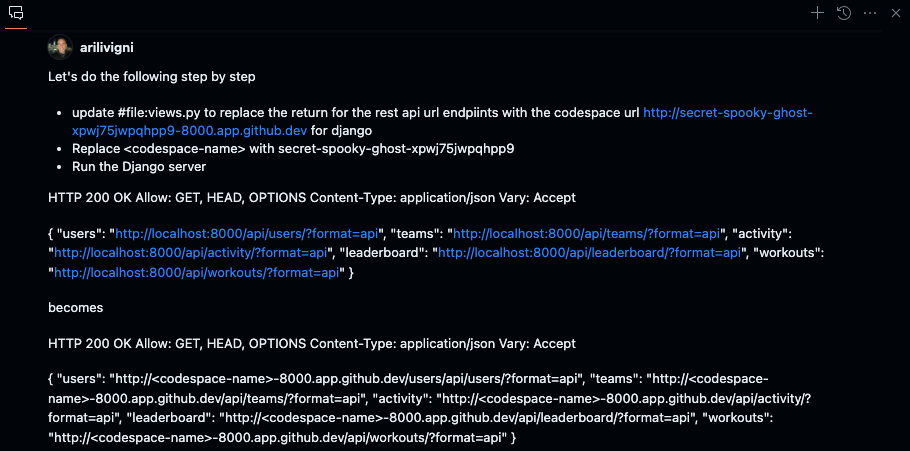
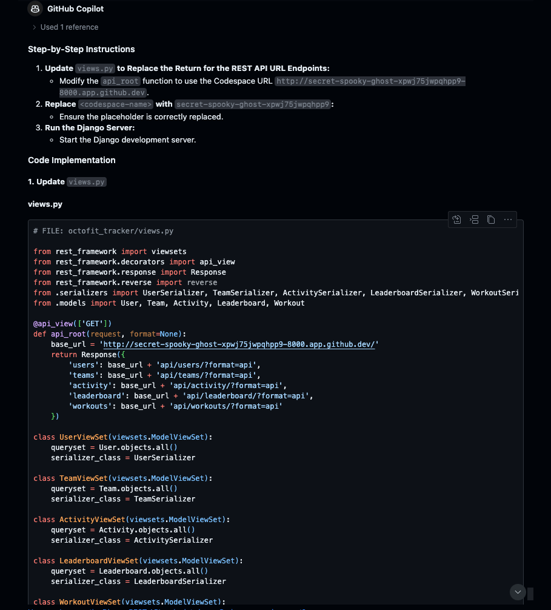
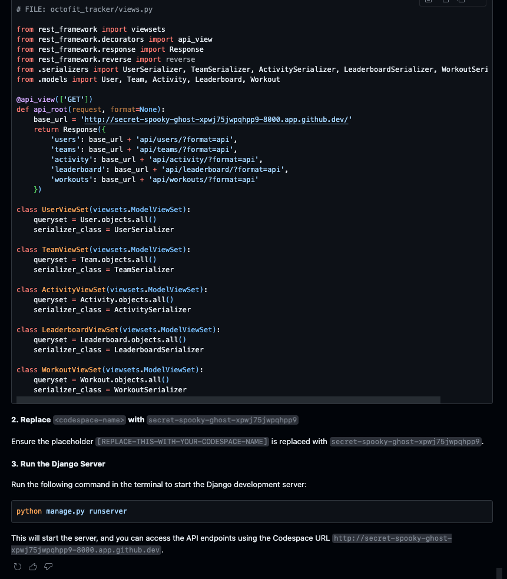

# Using the Codespace endpoint to access the Django REST Framework

> NOTE: Skip this step if not using codespaces

Type the following prompt in GitHub Copilot Chat:

> NOTE: Replace `[REPLACE-THIS-WITH-YOUR-CODESPACE-NAME]` with the name of your codespace

```text
Let's do the following step by step

- update #file:views.py to replace the return for the rest api url endpiints with the codespace url http://[REPLACE-THIS-WITH-YOUR-CODESPACE-NAME]-8000.app.github.dev for django
- Replace <codespace-name> with [REPLACE-THIS-WITH-YOUR-CODESPACE-NAME]
- Run the Django server

HTTP 200 OK
Allow: GET, HEAD, OPTIONS
Content-Type: application/json
Vary: Accept

{
    "users": "http://localhost:8000/api/users/?format=api",
    "teams": "http://localhost:8000/api/teams/?format=api",
    "activity": "http://localhost:8000/api/activity/?format=api",
    "leaderboard": "http://localhost:8000/api/leaderboard/?format=api",
    "workouts": "http://localhost:8000/api/workouts/?format=api"
}

becomes

HTTP 200 OK Allow: GET, HEAD, OPTIONS Content-Type: application/json Vary: Accept

{ 
    "users": "http://<codespace-name>-8000.app.github.dev/users/api/users/?format=api",
    "teams": "http://<codespace-name>-8000.app.github.dev/api/teams/?format=api",
    "activity": "http://<codespace-name>-8000.app.github.dev/api/activity/?format=api",
    "leaderboard": "http://<codespace-name>-8000.app.github.dev/api/leaderboard/?format=api",
    "workouts": "http://<codespace-name>-8000.app.github.dev/api/workouts/?format=api" 
}
```





## Update to views.py

```python
# FILE: octofit_tracker/views.py

from rest_framework import viewsets
from rest_framework.decorators import api_view
from rest_framework.response import Response
from rest_framework.reverse import reverse
from .serializers import UserSerializer, TeamSerializer, ActivitySerializer, LeaderboardSerializer, WorkoutSerializer
from .models import User, Team, Activity, Leaderboard, Workout

@api_view(['GET'])
def api_root(request, format=None):
    base_url = 'http://[REPLACE-THIS-WITH-YOUR-CODESPACE-NAME]-8000.app.github.dev/'
    return Response({
        'users': base_url + 'api/users/?format=api',
        'teams': base_url + 'api/teams/?format=api',
        'activity': base_url + 'api/activity/?format=api',
        'leaderboard': base_url + 'api/leaderboard/?format=api',
        'workouts': base_url + 'api/workouts/?format=api'
    })

class UserViewSet(viewsets.ModelViewSet):
    queryset = User.objects.all()
    serializer_class = UserSerializer

class TeamViewSet(viewsets.ModelViewSet):
    queryset = Team.objects.all()
    serializer_class = TeamSerializer

class ActivityViewSet(viewsets.ModelViewSet):
    queryset = Activity.objects.all()
    serializer_class = ActivitySerializer

class LeaderboardViewSet(viewsets.ModelViewSet):
    queryset = Leaderboard.objects.all()
    serializer_class = LeaderboardSerializer

class WorkoutViewSet(viewsets.ModelViewSet):
    queryset = Workout.objects.all()
    serializer_class = WorkoutSerializer
```

## Run the server

```bash
python manage.py runserver
```

[:arrow_backward: Previous: Populate DB data](../6_PopulateDBwData) | [Next: What's next :arrow_forward:](../8_WhatsNext/README.md)